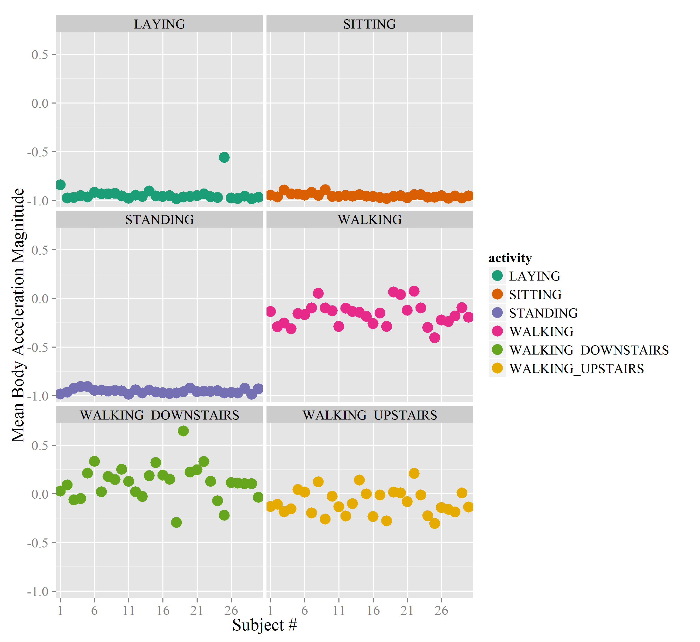

# Codebook #

The objective of this document is to describe the process that I followed in order to create a tidy data set from the ["University of California, Irvine (UCI) Human Activity Recognition (HAR) Using Smartphones Data Set"](http://archive.ics.uci.edu/ml/datasets/Human+Activity+Recognition+Using+Smartphones).

## Variables
This data set includes a file (i.e. "features_info.txt") that describes the variables contained in the UCI HAR using Smartphones data set including the mean and standard deviation variables enumerated in Table #1.  For example, the authors of the following journal article:

[1] Davide Anguita, Alessandro Ghio, Luca Oneto, Xavier Parra and Jorge L. Reyes-Ortiz. Human Activity Recognition on Smartphones using a Multiclass Hardware-Friendly Support Vector Machine. International Workshop of Ambient Assisted Living (IWAAL 2012). Vitoria-Gasteiz, Spain. Dec 2012.

mention that "the features selected for this database come from the accelerometer and gyroscope 3-axis raw signals tAcc-XYZ and tGyroscope-XYZ" [1]. In addition, this text document (i.e. "features_info.txt") contains a detailed description of the processing applied to the raw data in order to generate time and frequency domain features. For example, the authors of the above journal article applied both a median and a "3rd order Butterworth low-pass filter with a corner frequency of 20 Hz to remove noise" [1]. In addition, this description of the raw data pre-processing mentions that these authors "separated [the] body and gravity acceleration signals" using the same type of low-pass filter with a lower corner frequency (i.e. "0.3 Hz") [1].   
  
<!-- html table generated in R 3.1.0 by xtable 1.7-3 package -->
<!-- Sat May 17 23:39:06 2014 -->
<TABLE border=1>  
<caption> <u>Table #1</u>: Human Activity Recognition Using Smartphones Data Set Mean & Standard Deviation Variable Names [1] </caption>  
<TR> <TH> # </TH> <TH> Variable </TH> <TH> Domain </TH> <TH> Description </TH>  </TR>
  <TR> <TD align="right"> 1 </TD> <TD> tBodyAccXMean </TD> <TD> Time </TD> <TD> Body x-axis mean acceleration </TD> </TR>
  <TR> <TD align="right"> 2 </TD> <TD> tBodyAccYMean </TD> <TD> Time </TD> <TD> Body y-axis mean acceleration </TD> </TR>
  <TR> <TD align="right"> 3 </TD> <TD> tBodyAccZMean </TD> <TD> Time </TD> <TD> Body z-axis mean acceleration </TD> </TR>
  <TR> <TD align="right"> 4 </TD> <TD> tBodyAccXStd </TD> <TD> Time </TD> <TD> Body x-axis acceleration standard deviation </TD> </TR>
  <TR> <TD align="right"> 5 </TD> <TD> tBodyAccYStd </TD> <TD> Time </TD> <TD> Body y-axis acceleration standard deviation </TD> </TR>
  <TR> <TD align="right"> 6 </TD> <TD> tBodyAccZStd </TD> <TD> Time </TD> <TD> Body z-axis acceleration standard deviation </TD> </TR>
  <TR> <TD align="right"> 7 </TD> <TD> tGravityAccXMean </TD> <TD> Time </TD> <TD> Gravity x-axis mean acceleration </TD> </TR>
  <TR> <TD align="right"> 8 </TD> <TD> tGravityAccYMean </TD> <TD> Time </TD> <TD> Gravity y-axis mean acceleration </TD> </TR>
  <TR> <TD align="right"> 9 </TD> <TD> tGravityAccZMean </TD> <TD> Time </TD> <TD> Gravity z-axis mean acceleration </TD> </TR>
  <TR> <TD align="right"> 10 </TD> <TD> tGravityAccXStd </TD> <TD> Time </TD> <TD> Gravity x-axis acceleration standard deviation </TD> </TR>
  <TR> <TD align="right"> 11 </TD> <TD> tGravityAccYStd </TD> <TD> Time </TD> <TD> Gravity y-axis acceleration standard deviation </TD> </TR>
  <TR> <TD align="right"> 12 </TD> <TD> tGravityAccZStd </TD> <TD> Time </TD> <TD> Gravity z-axis acceleration standard deviation </TD> </TR>
  <TR> <TD align="right"> 13 </TD> <TD> tBodyAccJerkXMean </TD> <TD> Time </TD> <TD> Body mean x-axis acceleration derivative </TD> </TR>
  <TR> <TD align="right"> 14 </TD> <TD> tBodyAccJerkYMean </TD> <TD> Time </TD> <TD> Body mean y-axis acceleration derivative </TD> </TR>
  <TR> <TD align="right"> 15 </TD> <TD> tBodyAccJerkZMean </TD> <TD> Time </TD> <TD> Body mean z-axis acceleration derivative </TD> </TR>
  <TR> <TD align="right"> 16 </TD> <TD> tBodyAccJerkXStd </TD> <TD> Time </TD> <TD> Body x-axis acceleration derivative standard deviation </TD> </TR>
  <TR> <TD align="right"> 17 </TD> <TD> tBodyAccJerkYStd </TD> <TD> Time </TD> <TD> Body y-axis acceleration derivative standard deviation </TD> </TR>
  <TR> <TD align="right"> 18 </TD> <TD> tBodyAccJerkZStd </TD> <TD> Time </TD> <TD> Body z-axis acceleration derivative standard deviation </TD> </TR>
  <TR> <TD align="right"> 19 </TD> <TD> tBodyGyroXMean </TD> <TD> Time </TD> <TD> Body mean x-axis gyroscope </TD> </TR>
  <TR> <TD align="right"> 20 </TD> <TD> tBodyGyroYMean </TD> <TD> Time </TD> <TD> Body mean y-axis gyroscope </TD> </TR>
  <TR> <TD align="right"> 21 </TD> <TD> tBodyGyroZMean </TD> <TD> Time </TD> <TD> Body mean z-axis gyroscope </TD> </TR>
  <TR> <TD align="right"> 22 </TD> <TD> tBodyGyroXStd </TD> <TD> Time </TD> <TD> Body x-axis gyroscope standard deviation </TD> </TR>
  <TR> <TD align="right"> 23 </TD> <TD> tBodyGyroYStd </TD> <TD> Time </TD> <TD> Body y-axis gyroscope standard deviation </TD> </TR>
  <TR> <TD align="right"> 24 </TD> <TD> tBodyGyroZStd </TD> <TD> Time </TD> <TD> Body z-axis gyroscope standard deviation </TD> </TR>
  <TR> <TD align="right"> 25 </TD> <TD> tBodyGyroJerkXMean </TD> <TD> Time </TD> <TD> Body mean x-axis gyroscope derivative </TD> </TR>
  <TR> <TD align="right"> 26 </TD> <TD> tBodyGyroJerkYMean </TD> <TD> Time </TD> <TD> Body mean y-axis gyroscope derivative </TD> </TR>
  <TR> <TD align="right"> 27 </TD> <TD> tBodyGyroJerkZMean </TD> <TD> Time </TD> <TD> Body mean z-axis gyroscope derivative </TD> </TR>
  <TR> <TD align="right"> 28 </TD> <TD> tBodyGyroJerkXStd </TD> <TD> Time </TD> <TD> Body x-axis gyroscope derivative standard deviation </TD> </TR>
  <TR> <TD align="right"> 29 </TD> <TD> tBodyGyroJerkYStd </TD> <TD> Time </TD> <TD> Body y-axis gyroscope derivative standard deviation </TD> </TR>
  <TR> <TD align="right"> 30 </TD> <TD> tBodyGyroJerkZStd </TD> <TD> Time </TD> <TD> Body z-axis gyroscope derivative standard deviation </TD> </TR>
  <TR> <TD align="right"> 31 </TD> <TD> tBodyAccMagMean </TD> <TD> Time </TD> <TD> Body mean acceleration magnitude </TD> </TR>
  <TR> <TD align="right"> 32 </TD> <TD> tBodyAccMagStd </TD> <TD> Time </TD> <TD> Body acceleration standard deviation </TD> </TR>
  <TR> <TD align="right"> 33 </TD> <TD> tGravityAccMagMean </TD> <TD> Time </TD> <TD> Gravity mean acceleration magnitude </TD> </TR>
  <TR> <TD align="right"> 34 </TD> <TD> tGravityAccMagStd </TD> <TD> Time </TD> <TD> Gravity acceleration magnitude standard deviation </TD> </TR>
  <TR> <TD align="right"> 35 </TD> <TD> tBodyAccJerkMagMean </TD> <TD> Time </TD> <TD> Body mean acceleration derivative magnitude </TD> </TR>
  <TR> <TD align="right"> 36 </TD> <TD> tBodyAccJerkMagStd </TD> <TD> Time </TD> <TD> Body acceleration derivative magnitude standard deviation </TD> </TR>
  <TR> <TD align="right"> 37 </TD> <TD> tBodyGyroMagMean </TD> <TD> Time </TD> <TD> Body mean gyroscope magnitude </TD> </TR>
  <TR> <TD align="right"> 38 </TD> <TD> tBodyGyroMagStd </TD> <TD> Time </TD> <TD> Body gyroscope magnitude standard deviation </TD> </TR>
  <TR> <TD align="right"> 39 </TD> <TD> tBodyGyroJerkMagMean </TD> <TD> Time </TD> <TD> Body mean gyroscope derivative magnitude </TD> </TR>
  <TR> <TD align="right"> 40 </TD> <TD> tBodyGyroJerkMagStd </TD> <TD> Time </TD> <TD> Body gyroscope derivative magnitude standard deviation </TD> </TR>
  <TR> <TD align="right"> 41 </TD> <TD> fBodyAccXMean </TD> <TD> Frequency </TD> <TD> Mean FFT(Body x-axis acceleration) magnitude </TD> </TR>
  <TR> <TD align="right"> 42 </TD> <TD> fBodyAccYMean </TD> <TD> Frequency </TD> <TD> Mean FFT(Body y-axis acceleration) magnitude </TD> </TR>
  <TR> <TD align="right"> 43 </TD> <TD> fBodyAccZMean </TD> <TD> Frequency </TD> <TD> Mean FFT(Body z-axis acceleration) magnitude </TD> </TR>
  <TR> <TD align="right"> 44 </TD> <TD> fBodyAccXStd </TD> <TD> Frequency </TD> <TD> FFT(Body x-axis acceleration) magnitude standard deviation </TD> </TR>
  <TR> <TD align="right"> 45 </TD> <TD> fBodyAccYStd </TD> <TD> Frequency </TD> <TD> FFT(Body y-axis acceleration) magnitude standard deviation </TD> </TR>
  <TR> <TD align="right"> 46 </TD> <TD> fBodyAccZStd </TD> <TD> Frequency </TD> <TD> FFT(Body z-axis acceleration) magnitude standard deviation </TD> </TR>
  <TR> <TD align="right"> 47 </TD> <TD> fBodyAccXMeanFreq </TD> <TD> Frequency </TD> <TD> Body mean x-axis acceleration frequency </TD> </TR>
  <TR> <TD align="right"> 48 </TD> <TD> fBodyAccYMeanFreq </TD> <TD> Frequency </TD> <TD> Body mean y-axis acceleration frequency </TD> </TR>
  <TR> <TD align="right"> 49 </TD> <TD> fBodyAccZMeanFreq </TD> <TD> Frequency </TD> <TD> Body mean z-axis acceleration frequency </TD> </TR>
  <TR> <TD align="right"> 50 </TD> <TD> fBodyAccJerkXMean </TD> <TD> Frequency </TD> <TD> Mean FFT(Body x-axis acceleration derivative) magnitude </TD> </TR>
  <TR> <TD align="right"> 51 </TD> <TD> fBodyAccJerkYMean </TD> <TD> Frequency </TD> <TD> Mean FFT(Body y-axis acceleration derivative) magnitude </TD> </TR>
  <TR> <TD align="right"> 52 </TD> <TD> fBodyAccJerkZMean </TD> <TD> Frequency </TD> <TD> Mean FFT(Body z-axis acceleration derivative) magnitude </TD> </TR>
  <TR> <TD align="right"> 53 </TD> <TD> fBodyAccJerkXStd </TD> <TD> Frequency </TD> <TD> FFT(Body x-axis acceleration derivative) magnitude standard deviation </TD> </TR>
  <TR> <TD align="right"> 54 </TD> <TD> fBodyAccJerkYStd </TD> <TD> Frequency </TD> <TD> FFT(Body y-axis acceleration derivative) magnitude standard deviation </TD> </TR>
  <TR> <TD align="right"> 55 </TD> <TD> fBodyAccJerkZStd </TD> <TD> Frequency </TD> <TD> FFT(Body z-axis acceleration derivative) magnitude standard deviation </TD> </TR>
  <TR> <TD align="right"> 56 </TD> <TD> fBodyAccJerkXMeanFreq </TD> <TD> Frequency </TD> <TD> Body mean x-axis acceleration derivative frequency </TD> </TR>
  <TR> <TD align="right"> 57 </TD> <TD> fBodyAccJerkYMeanFreq </TD> <TD> Frequency </TD> <TD> Body mean y-axis acceleration derivative frequency </TD> </TR>
  <TR> <TD align="right"> 58 </TD> <TD> fBodyAccJerkZMeanFreq </TD> <TD> Frequency </TD> <TD> Body mean z-axis acceleration derivative frequency </TD> </TR>
  <TR> <TD align="right"> 59 </TD> <TD> fBodyGyroXMean </TD> <TD> Frequency </TD> <TD> Mean FFT(Body x-axis gyroscope) magnitude </TD> </TR>
  <TR> <TD align="right"> 60 </TD> <TD> fBodyGyroYMean </TD> <TD> Frequency </TD> <TD> Mean FFT(Body y-axis gyroscope) magnitude </TD> </TR>
  <TR> <TD align="right"> 61 </TD> <TD> fBodyGyroZMean </TD> <TD> Frequency </TD> <TD> Mean FFT(Body z-axis gyroscope) magnitude </TD> </TR>
  <TR> <TD align="right"> 62 </TD> <TD> fBodyGyroXStd </TD> <TD> Frequency </TD> <TD> FFT(Body x-axis gyroscope) magnitude standard deviation </TD> </TR>
  <TR> <TD align="right"> 63 </TD> <TD> fBodyGyroYStd </TD> <TD> Frequency </TD> <TD> FFT(Body y-axis gyroscope) magnitude standard deviation </TD> </TR>
  <TR> <TD align="right"> 64 </TD> <TD> fBodyGyroZStd </TD> <TD> Frequency </TD> <TD> FFT(Body z-axis gyroscope) magnitude standard deviation </TD> </TR>
  <TR> <TD align="right"> 65 </TD> <TD> fBodyGyroXMeanFreq </TD> <TD> Frequency </TD> <TD> Body x-axis gyroscope mean frequency </TD> </TR>
  <TR> <TD align="right"> 66 </TD> <TD> fBodyGyroYMeanFreq </TD> <TD> Frequency </TD> <TD> Body y-axis gyroscope mean frequency </TD> </TR>
  <TR> <TD align="right"> 67 </TD> <TD> fBodyGyroZMeanFreq </TD> <TD> Frequency </TD> <TD> Body z-axis gyroscope mean frequency </TD> </TR>
  <TR> <TD align="right"> 68 </TD> <TD> fBodyAccMagMean </TD> <TD> Frequency </TD> <TD> Mean FFT(Body acceleration) magnitude </TD> </TR>
  <TR> <TD align="right"> 69 </TD> <TD> fBodyAccMagStd </TD> <TD> Frequency </TD> <TD> FFT(Body acceleration) magnitude standard deviation </TD> </TR>
  <TR> <TD align="right"> 70 </TD> <TD> fBodyAccMagMeanFreq </TD> <TD> Frequency </TD> <TD> Body acceleration magnitude mean frequency </TD> </TR>
  <TR> <TD align="right"> 71 </TD> <TD> fBodyBodyAccJerkMagMean </TD> <TD> Frequency </TD> <TD> Mean FFT(Body acceleration derivative) magnitude </TD> </TR>
  <TR> <TD align="right"> 72 </TD> <TD> fBodyBodyAccJerkMagStd </TD> <TD> Frequency </TD> <TD> FFT(Body acceleration derivative) standard deviation </TD> </TR>
  <TR> <TD align="right"> 73 </TD> <TD> fBodyBodyAccJerkMagMeanFreq </TD> <TD> Frequency </TD> <TD> Body acceleration derivative mean frequency </TD> </TR>
  <TR> <TD align="right"> 74 </TD> <TD> fBodyBodyGyroMagMean </TD> <TD> Frequency </TD> <TD> Mean FFT(Body gyroscope) magnitude </TD> </TR>
  <TR> <TD align="right"> 75 </TD> <TD> fBodyBodyGyroMagStd </TD> <TD> Frequency </TD> <TD> FFT(Body gyroscope) magnitude standard deviation </TD> </TR>
  <TR> <TD align="right"> 76 </TD> <TD> fBodyBodyGyroMagMeanFreq </TD> <TD> Frequency </TD> <TD> Body gyroscope magnitude mean frequency </TD> </TR>
  <TR> <TD align="right"> 77 </TD> <TD> fBodyBodyGyroJerkMagMean </TD> <TD> Frequency </TD> <TD> Mean FFT(Body gyroscope derivative) magnitude </TD> </TR>
  <TR> <TD align="right"> 78 </TD> <TD> fBodyBodyGyroJerkMagStd </TD> <TD> Frequency </TD> <TD> FFT(Body gyroscope derivative) magnitude standard deviation </TD> </TR>
  <TR> <TD align="right"> 79 </TD> <TD> fBodyBodyGyroJerkMagMeanFreq </TD> <TD> Frequency </TD> <TD> Body gyroscope derivative magnitude mean frequency </TD> </TR>
  <TR> <TD align="right"> 80 </TD> <TD> angle.tBodyAccMean.gravity </TD> <TD> Time </TD> <TD> angle(Body mean acceleration, gravity) </TD> </TR>
  <TR> <TD align="right"> 81 </TD> <TD> angle.tBodyAccJerkMean.gravityMean </TD> <TD> Time </TD> <TD> angle(Body mean acceleration derivative, mean gravity) </TD> </TR>
  <TR> <TD align="right"> 82 </TD> <TD> angle.tBodyGyroMean.gravityMean </TD> <TD> Time </TD> <TD> angle(Body mean gyroscope, mean gravity) </TD> </TR>
  <TR> <TD align="right"> 83 </TD> <TD> angle.tBodyGyroJerkMean.gravityMean </TD> <TD> Time </TD> <TD> angle(Body mean gyroscope derivative, mean gravity) </TD> </TR>
  <TR> <TD align="right"> 84 </TD> <TD> angle.X.gravityMean </TD> <TD> Time </TD> <TD> angle(X-axis, mean gravity) </TD> </TR>
  <TR> <TD align="right"> 85 </TD> <TD> angle.Y.gravityMean </TD> <TD> Time </TD> <TD> angle(Y-axis, mean gravity) </TD> </TR>
  <TR> <TD align="right"> 86 </TD> <TD> angle.Z.gravityMean </TD> <TD> Time </TD> <TD> angle(Z-axis, mean gravity) </TD> </TR>
   </TABLE>

## Data Transformations    
  
The top-level flow of the R script (i.e. `run_analysis.R`) that I wrote to create a tidy data set that contains UCI HAR Smartphone mean and standard deviation data set variables is composed of the following nine steps:  
1. [Verify that the required R packages are installed](http://stackoverflow.com/questions/9341635/how-can-i-check-for-installed-r-packages-before-running-install-packages)  
2. [Reset the R environment](http://stackoverflow.com/questions/14187048/r-language-clean-variables-and-close-connections)    
3. Initialize the Uniform Resource Locator (i.e. URL) that refers to the compressed UCI HAR Smartphone Smartphone dataset.  
4. Determine whether or not the getdata-projectfiles-UCI HAR dataset folder exists in the directory where `run_analysis.R` is being run.If this folder doesn't exist, `run_analysis.R` downloads this zip using [binary mode](http://stackoverflow.com/questions/9655361/download-png-jpg-with-r). Next, it extracts the contents of this zip file using the [unzip](http://www.r-bloggers.com/read-compressed-zip-files-in-r/) function.  
5. Initialize the path to the top-level of the UCI HAR smartphone data set.    
6. Load the combined training & test data set.  
7. Computes the average value of each variable for each activity and subject using the aggregate function that is part of the [plyr package](http://stackoverflow.com/questions/11370323/learning-to-understand-plyr-ddply).  
8. Order the resulting data frame by the subject using the arrange function that is included in the plyr package. This function was mentioned in the following presentation by Hadley Wickham: ["Tidy data & tidy tools"](http://vimeo.com/33727555). In addition, a link to the slides for this presentation is provided in a Promethus Research blog article entitled ["Good Data Management Practices for Data Analysis: Tidy Data (Part 2)](http://www.prometheusresearch.com/good-data-management-practices-for-data-analysis-tidy-data-part-2/).  
9. Write the tidy data set to a text file using *write.table()* function with the *row.names* option set to FALSE.  

The procedure that I followed to create a combined training & test data set begins with loading a description of the variables (i.e. features) stored in the *features.txt* file located in the "UCI HAR Dataset" folder.  
  
The first processing step that I apply is removing the feature number from the feature name via the following gsub function call:  
  
`features <- gsub("[0-9]+\\s+","",features)`.  
  
Next, `run_analysis.R` loops through the feature names and applies the regular expressions defined in Table #2 to separate substring groups from the "HCI HAR Smartphone" data set variable names. This R script subsequently reformats each feature name whose format is defined by one of the rows in the left column of Table #2 into the transformed feature name illustrated in the corresponding right column in this table. In addition, the regular expressions included in the center column of Table #2 are based on the following examples:
    
- [Regular expression for matching parentheses](http://stackoverflow.com/questions/5633533/regular-expression-for-matching-parentheses)    
- [Regex group capture in R](http://stackoverflow.com/questions/952275/regex-group-capture-in-r)  
  
<!-- html table generated in R 3.1.0 by xtable 1.7-3 package -->
<!-- Sun May 18 14:17:29 2014 -->
<TABLE border=1>  
<caption> <u>Table #2</u>: Reformat UCI HAR Smartphone data set variable names</caption>
<TR> <TH> Scenario # </TH> <TH> Feature Name </TH> <TH> Regular Expression </TH> <TH> Transformed Feature Name </TH>  </TR>
  <TR> <TD align="center"> 1 </TD> <TD> tBodyAcc-mean()-X </TD> <TD> ([A-Za-z]+)-([A-Za-z]+)[(][)]-([A-Z]) </TD> <TD> tBodyAccXMean </TD> </TR>
  <TR> <TD align="center"> 2 </TD> <TD> tBodyAcc-arCoeff()-X,2 </TD> <TD> ([A-Za-z]+)-([A-Za-z]+)[(][)]-([A-Z]),([0-9]) </TD> <TD> tBodyAccArCoeffX2 </TD> </TR>
  <TR> <TD align="center"> 3 </TD> <TD> tBodyAcc-correlation()-X,Y </TD> <TD> ([A-Za-z]+)-([A-Za-z]+)[(][)]-([A-Z]),([A-Z]) </TD> <TD> tBodyAccXYCorrelation </TD> </TR>
  <TR> <TD align="center"> 4 </TD> <TD> tBodyGyroJerkMag-arCoeff()2 </TD> <TD> ([A-Za-z]+)-([A-Za-z]+)[(][)]([0-9]) </TD> <TD> tBodyGyroJerkMagArCoeff2 </TD> </TR>
  <TR> <TD align="center"> 5 </TD> <TD> fBodyAcc-bandsEnergy()-25,48 </TD> <TD> ([A-Za-z]+)-([A-Za-z]+)[(][)]-([0-9]+),([0-9]+) </TD> <TD> fBodyAccBandsEnergy.25.48 </TD> </TR>
  <TR> <TD align="center"> 6 </TD> <TD> angle(tBodyGyroMean,gravityMean) </TD> <TD> ([a-z]+)[(]([A-Za-z]+)[)]*,([A-Za-z]+)[)] </TD> <TD> angle.tBodyGyroMean.gravityMean </TD> </TR>
  <TR> <TD align="center"> 7 </TD> <TD> fBodyBodyGyroJerkMag-skewness() </TD> <TD> ([A-Za-z]+)-([A-Za-z]+)[(]*[)]* </TD> <TD> fBodyBodyGyroJerkMagSkewness </TD> </TR>
  <TR> <TD align="center"> 8 </TD> <TD> fBodyAccJerk-maxInds-Y </TD> <TD> ([A-Za-z]+)-([A-Za-z]+)-([A-Z]) </TD> <TD> fBodyAccJerkYMaxInds </TD> </TR>
   </TABLE>

Once `run_analysis.R` has reformatted the UCI HAR Smartphone data set variable names, it loads the activity labels into memory. Similar to the feature names, this R script removes the activity number from the activity label. Once this processing step is complete, this R script loads the training data into memory using the `read.table` function. Next, it sets the column (i.e. variable) names of this data frame using the `colnames` function. 

After `run_analysis.R` has loaded the training data into memory, it reads the subject data that is stored in the *subject_train.txt* file in the train sub-folder. It is important to specify the "read binary" (i.e "rb") option when reading both the subject and activity data because they are stored using a binary file format. In addition, `run_analysis.R` also transforms the subject data into a [factor variable](http://www.ats.ucla.edu/stat/r/modules/factor_variables.htm). Since the activity data file contains the activity numbers (i.e. "1" for "WALKING"), this R script assigns the corresponding label for each activity sample prior to transforming it into a factor variable. In addition, `run_analysis.R` also adds a column to the training data set that identifies its type (i.e. 'train').

Next, this R-script loads the test data into memory using the same procedure and merges it with the training data using the `rbind` function. Once this processing step is complete, `run_analysis.R` subsets the mean and standard deviation of each UCI HAR Smartphone data set variable using the [subset](http://www.ats.ucla.edu/stat/r/faq/subset_R.htm) function. The final step required to transform the resulting data frame into a tidy data set is [adjusting the order of the subject factor variable such that it is in ascending order](http://www.cookbook-r.com/Manipulating_data/Changing_the_order_of_levels_of_a_factor/).  
  
The defining characteristic of a "tidy tool" identified by Hadley Wickham in his presentation entitled ["Tidy data & tidy tools"](http://vimeo.com/33727555) is that it operates on tidy data and does not change its format. Therefore, I generated a visualization of one of the variables contained in the tidy data set generated by `run_analysis.R` using a tidy tool (i.e. ggplot2). Since no errors or warnings occurred during the generation of the plot shown in Figure #1, this result suggest that `run_analysis.R` correctly generated a tidy data set.   

Figure #1: Mean Body Acceleration Magnitude
 
  
## Markdown Syntax References
The following references were used to generate this Markdown document:  
1. [Revolution Analytics blog article: "Making Publication Ready Tables with xtable"](http://blog.revolutionanalytics.com/2010/02/making-publicationready-tables-with-xtable.html)  
2. ["print.xtable only displays, doesn't save to disk"](http://stackoverflow.com/questions/6295579/print-xtable-only-displays-doesnt-save-to-disk)  
3. [Github Markdown Syntax](https://github.com/adam-p/markdown-here/wiki/Markdown-Cheatsheet#lines)  
4. [HTML table caption](http://www.w3schools.com/tags/tag_caption.asp)  
5. [Line Break](http://stackoverflow.com/questions/13730982/force-line-break-br-in-header-h1-in-markdown)  
6. ["Markdown to insert and display image on github repo"](http://webapps.stackexchange.com/questions/29602/markdown-to-insert-and-display-an-image-on-github-repo)  
